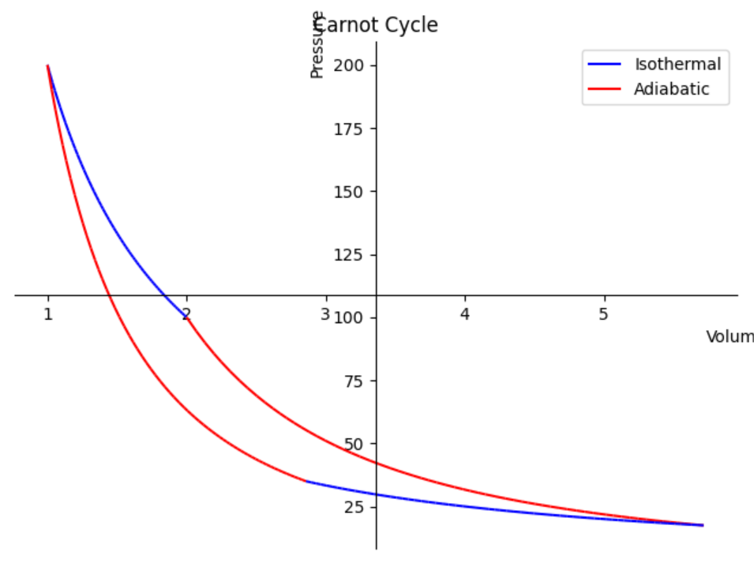
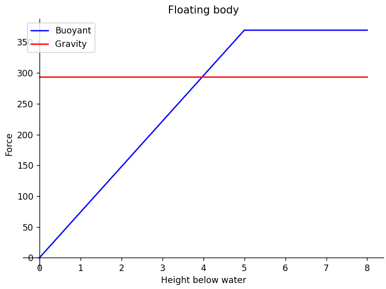

# Description

Physics laws implemented as code. Based on [SymPy](https://github.com/sympy/sympy) Python library.

# Sample generated plots




# How to install

```sh
python3 setup.py install --user
```

Install **matplotlib** for plotting support:

```sh
pip install matplotlib
```

# How to run

With **symplyphysics** installed:

```sh
cd examples/force_from_acceleration
python3 main.py
```

Without **symplyphysics** installed:

```sh
PYTHONPATH=. python3 ./examples/force_from_acceleration/main.py
```

# How to test

Install **pytest**:

```sh
pip install pytest
```

Run tests:

```sh
pytest
```

> **_NOTE:_**  for Windows users **Python/Scripts** folder should be added to the PATH environment variable
